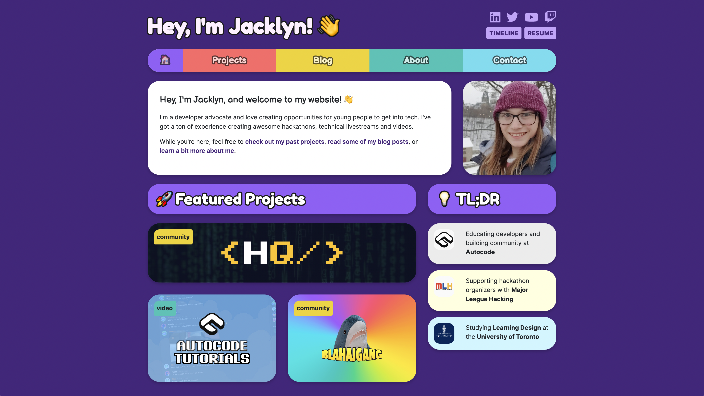

# 🚀 jacklyn.dev - my portfolio website

## ❓ What is this repo?
This is my personal website, available at [jacklyn.dev](https://jacklyn.dev)! I streamed myself building the core foundations over on [Twitch](https://twitch.tv/jacklynbiggin), and then finished it off during [INIT 2023](https://init.mlh.io).

## 🛠 Tech Stack
* Built using [Next.js](https://nextjs.org/) (bootstrapped with `create-next-app`)
* Uses [Font Awesome](https://fontawesome.com/)'s [React component](https://fontawesome.com/v5/docs/web/use-with/react) for icons
* Makes use of [React-Bootstrap](https://react-bootstrap-v4.netlify.app/) (1.x - so Bootstrap 4) for layout/helper classes
* Email form on the contact page uses [Formspark's API](https://formspark.io/)
* [Imgbot](https://imgbot.net/) automagically compresses images in this repo to help speed up load times
* [Animate.css](https://animate.style/) is used for some animations
* The live site is deployed to [Vercel](https://vercel.com)

## ✨ Local Setup
1. Clone this git repo and navigate to the repo's folder
2. Run the development server with `npm run dev`
3. You can now access the live preview by going to [http://localhost:3000](http://localhost:3000)

This project is structured like your typical Next.js project, so I'd recommend referring to [their docs](https://nextjs.org/docs) when making any changes.

## 💭 Useful things to know
* The colours used across the website are set in `styles/globals.css` as CSS variables
  * There's also some other useful variables set in there, such as ways to easily add the correct drop shadow, text shadow (for outlines) and border-radius to elements

## 📝 License
The code from this project is licensed under the [MIT License](LICENSE). Images, including logos are property of their respective copyright owners.

